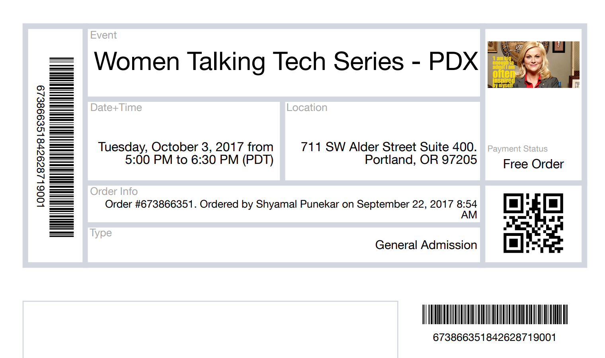

# NgMyPortfolio Extended

#### This Portfolio webpage will provide my skills, knowledge,experience , 09.29.2017

#### By Shyamal Punekar

## Description

_Web application gives an information about my educational background, skills, technologies, current education, future Goals.._

## Setup/Installation Requirements
* Clone the repo
* navigate to  project root folder
* ng serve to launch an application

This project was generated with [Angular CLI](https://github.com/angular/angular-cli) version 1.0.0.

# Screenshots
 _Upcoming Events those I'm attending:_
## Women Talking Tech Series - PDX [Oct-03]

## Women Talking Tech Series - PDX [Oct-10]

# Setup
https://github.com/shyamalpunekar/ngMyPortfolio-extended

# Support and contact details

  Please feel free to contact shyamal.punekar@gmail.com if you have any questions, issues, concerns, comments or suggestions.

# Known Bugs

_There are no known bugs at this time!_

## Technologies Used

* JavaScript/TypeScript
* atom
* html/css
* AngularJS
* Firebase

## Future Implementation

* Enhance web information on Firebase.

This project was generated with [Angular CLI](https://github.com/angular/angular-cli) version 1.0.0.

## Development server

Run `ng serve` for a dev server. Navigate to `http://localhost:4200/`. The app will automatically reload if you change any of the source files.

## Code scaffolding

Run `ng generate component component-name` to generate a new component. You can also use `ng generate directive/pipe/service/class/module`.

## Build

Run `ng build` to build the project. The build artifacts will be stored in the `dist/` directory. Use the `-prod` flag for a production build.

## Running unit tests

Run `ng test` to execute the unit tests via [Karma](https://karma-runner.github.io).

## Running end-to-end tests

Run `ng e2e` to execute the end-to-end tests via [Protractor](http://www.protractortest.org/).
Before running the tests make sure you are serving the app via `ng serve`.

## Further help

To get more help on the Angular CLI use `ng help` or go check out the [Angular CLI README](https://github.com/angular/angular-cli/blob/master/README.md).
